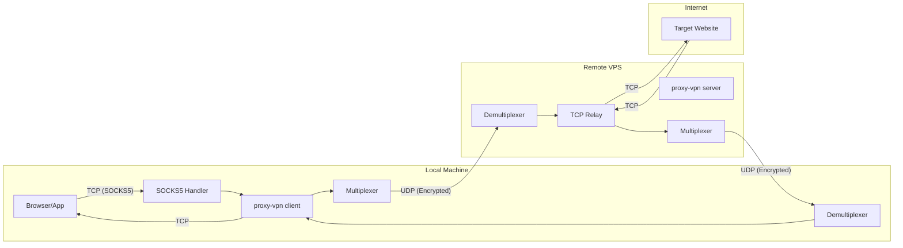
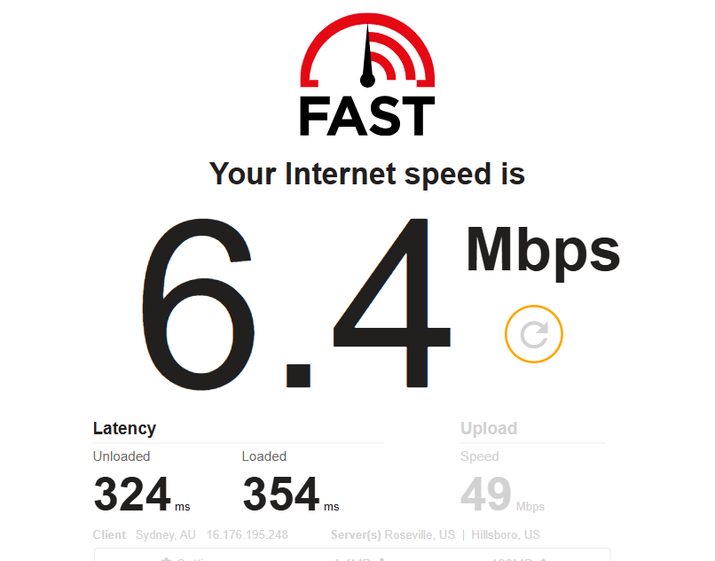
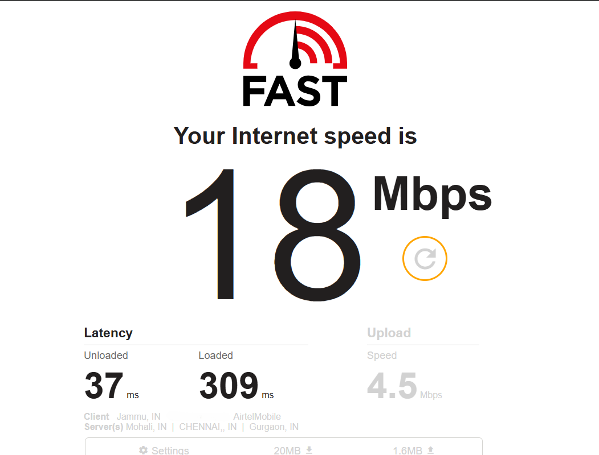

# Proxy-VPN: UDP-Tunneled Secure Proxy System

A high-performance, encrypted UDP tunnel implementing a SOCKS5-compatible proxy with session multiplexing, optimized for traversing restrictive network environments.

---

## Table of Contents

- [Architecture Overview](#architecture-overview)
- [Key Design Decisions & Trade-Offs](#key-design-decisions--trade-offs)
- [Core Components Deep Dive](#core-components-deep-dive)
- [Failure Modes & Reliability](#failure-modes--reliability)
- [Security & Compliance](#security--compliance)
- [Performance Insights](#performance-insights)
- [Extensibility & Future Roadmap](#extensibility--future-roadmap)
- [Setup Instructions](#setup-instructions)

---

## Architecture Overview

### System Design

The system implements a **split-architecture proxy** where:

1. **Client** runs locally, accepting SOCKS5 connections from browsers/applications
2. **Server** runs on a remote VPS, relaying traffic to the internet

All traffic between client and server is tunneled over a **single UDP socket** using a custom binary protocol with **XChaCha20-Poly1305 AEAD encryption**.



### Architectural Patterns

| Pattern                         | Implementation                             | Rationale                                       |
| ------------------------------- | ------------------------------------------ | ----------------------------------------------- |
| **Multiplexer/Demultiplexer**   | Channel-based goroutines for all UDP I/O   | Single UDP socket handles N concurrent sessions |
| **Session-per-Connection**      | `SessionContext` with sliding window       | Enables packet reordering over unreliable UDP   |
| **Interface-based Abstraction** | `Codec`, `Crypto` interfaces               | Hot-swappable serialization and encryption      |
| **Singleton with Lazy Init**    | Global `codec.C()`, `crypto.C()` accessors | Avoids dependency injection complexity          |
| **Object Pool**                 | `sync.Pool` for 1500-byte buffers          | Zero-allocation hot path                        |

### Protocol Wire Format

```
┌─────────────────────────────────────────────────────────────────────┐
│                         Encrypted Packet                            │
├──────────────┬─────────────────────────────────┬────────────────────┤
│ Nonce (24B)  │         Ciphertext              │ Poly1305 Tag (16B) │
└──────────────┴─────────────────────────────────┴────────────────────┘

Decrypted payload structure:
┌────────────┬──────┬────────────┬──────────┬────────────────────────┐
│ SessionID  │ Type │   SeqID    │  Length  │        Payload         │
│   (4B)     │ (1B) │   (4B)     │  (2B)    │      (variable)        │
└────────────┴──────┴────────────┴──────────┴────────────────────────┘
             │
             └─► TYPE_CONNECT=1, TYPE_DATA=2, TYPE_FIN=3, TYPE_PING=4, TYPE_PONG=5
```

**Header Size**: 11 bytes fixed  
**Max Payload**: 1449 bytes (1500 MTU - 11 header - 24 nonce - 16 tag)

---

## Key Design Decisions & Trade-Offs

### UDP over TCP Tunneling

**Choice**: UDP transport between client and server.

**Rationale**:

- Avoids TCP-over-TCP meltdown (retransmission amplification)
- Lower latency for real-time applications
- Better NAT traversal characteristics
- Mimics legitimate UDP traffic patterns (VoIP, gaming)

**Trade-off**: Required implementing an application-level ordering layer (sequence-based reordering) over UDP.

### XChaCha20-Poly1305 vs AES-GCM

**Choice**: XChaCha20-Poly1305 (extended nonce variant)

| Factor               | XChaCha20-Poly1305     | AES-GCM                     |
| -------------------- | ---------------------- | --------------------------- |
| Nonce size           | 24 bytes (safe random) | 12 bytes (requires counter) |
| Hardware accel       | Software-only          | AES-NI available            |
| Nonce collision risk | ~2^192 birthday bound  | ~2^48 birthday bound        |

**Rationale**: 24-byte random nonce eliminates nonce-management complexity—critical for UDP where packet ordering isn't guaranteed. Performance difference is marginal for tunnel workloads.

### Binary Codec vs Protobuf/MsgPack

**Choice**: Custom binary codec with fixed offsets.

```go
// internal/protocol/codec/binary.go
binary.BigEndian.PutUint32(buf[0:4], h.SessionID)
buf[4] = h.Type
binary.BigEndian.PutUint32(buf[5:9], h.SeqID)
binary.BigEndian.PutUint16(buf[9:11], h.Length)
```

**Rationale**:

- Zero allocation on encode/decode
- Deterministic 11-byte header
- No schema evolution needed (protocol is internal)
- Protobuf/MsgPack stubs exist but are disabled—future extensibility preserved

### Sliding Window Reordering

**Choice**: Per-session sequence-based window with strict in-order delivery.

```go
// internal/session/session.go
func (s *SessionContext) InsertPacket(seqID uint32, payload []byte, originalBuffer []byte) {
    if seqID < s.NextSeqID {
        // Drop late/duplicate packet
        return
    }
    s.Window[seqID] = item{payload: payload, original: originalBuffer}
    s.Signal <- struct{}{}
}
```

**Trade-off**:

- ✅ Out-of-order arrival is buffered
- ✅ TCP byte-stream correctness is preserved (no sequence skipping)
- ❌ No retransmission (missing packets cause head-of-line blocking until they arrive)

### Single UDP Socket Multiplexing

**Choice**: All sessions share one UDP socket.

**Architecture implications**:

- Client: `Multiplexer.SendChan` aggregates all outbound packets
- Server: `Demultiplexer` routes incoming packets by `SessionID`

**Trade-off**: Simplifies NAT pinhole management but requires careful channel sizing (2000-5000 capacity) to prevent backpressure.

---

## Core Components Deep Dive

### Protocol Layer (`internal/protocol/`)

#### Builder Pipeline

```
Packet → codec.Encode() → plaintext frame → crypto.Encrypt() → wire bytes
```

```go
func (b *Builder) Build(p *Packet) (OutboundWork, error) {
    encoded, _ := codec.C().Encode(p.Header, p.Buffer)  // Header into buffer
    encrypted, _ := crypto.C().Encrypt(p.Buffer, encoded)  // In-place encrypt
    return OutboundWork{Data: encrypted, OriginalBuffer: p.Buffer}, nil
}
```

**Key insight**: Buffer reuse—`p.Buffer` is the allocation, and all operations write into it.

#### Parser Pipeline

```
wire bytes → crypto.Decrypt() → plaintext → codec.Decode() → Packet
```

In-place decryption: `aead.Open(enc[:0], nonce, enc, nil)` overwrites ciphertext.

### Session Management (`internal/session/`)

#### SessionContext

Each browser connection produces one `SessionContext`:

```go
type SessionContext struct {
    TargetConn net.Conn        // Browser (client) or Website (server)
    Window     map[uint32]item // SeqID → payload for reordering
    NextSeqID  uint32          // Expected sequence
    Signal     chan struct{}   // Flush trigger
    Quit       chan struct{}   // Shutdown signal
    ClientAddr *net.UDPAddr    // Server-side: client's UDP address
}
```

**Flusher goroutine pattern**:

```go
func (s *SessionContext) runFlusher() {
    for {
        select {
        case <-s.Signal:
            s.flush()  // Flush only contiguous seq: NextSeqID, NextSeqID+1, ...
        case <-s.Quit:
            return
        }
    }
}
```

#### Registry

Thread-safe session lookup with `sync.RWMutex`:

```go
func (r *Registry) Get(sessionID uint32) (*SessionContext, bool) {
    r.mu.RLock()
    defer r.mu.RUnlock()
    sess, ok := r.sessions[sessionID]
    return sess, ok
}
```

### Client Implementation (`internal/client/`)

#### SOCKS5 Handshake

Full RFC 1928 implementation supporting:

- IPv4 (`0x01`)
- Domain name (`0x03`)
- IPv6 (`0x04`)

```go
func PerformSOCKS5Handshake(conn net.Conn) (string, error) {
    // 1. Read greeting (version + methods)
    // 2. Reply with no-auth (0x05, 0x00)
    // 3. Read CONNECT request
    // 4. Parse address type and extract target
    // 5. Send success reply
    return net.JoinHostPort(host, port), nil
}
```

**No authentication implemented**—suitable for local proxy use only.

#### Handler Flow

```go
func HandleBrowserSession(browserConn, registry, multiplexer, builder) {
    targetAddr := PerformSOCKS5Handshake(browserConn)
    sessID := GenerateSessionID()  // atomic increment
    sess := session.NewSession(browserConn)
    registry.Add(sessID, sess)

    // Send CONNECT packet
    multiplexer.SendChan <- builder.Build(connectPacket)

    // Relay loop: Browser → UDP
    for {
        n := browserConn.Read(buf[11:1460])  // Offset for header
        pkt := NewPacket(sessID, TYPE_DATA, seqID++, payload, buf)
        multiplexer.SendChan <- builder.Build(pkt)
    }
}
```

### Server Implementation (`internal/server/`)

#### Demultiplexer Packet Routing

```go
func (d *Demultiplexer) handlePacket(buf []byte, n int, clientAddr *net.UDPAddr) {
    pkt := d.Parser.Parse(buf[:n], buf)
    sess, ok := d.Registry.Get(pkt.Header.SessionID)

    switch pkt.Header.Type {
    case TYPE_CONNECT:
        if !ok {
            go d.setupAndRelay(sessionID, targetAddr, clientAddr)
        }
    case TYPE_DATA:
        if ok { sess.InsertPacket(seqID, payload, buf) }
    case TYPE_FIN:
        if ok { d.Registry.Delete(sessionID); sess.Close() }
    }
}
```

#### TCP Relay

Synchronous relay loop per session:

```go
func (d *Demultiplexer) runTCPRelay(sess, sessionID) {
    for {
        n := sess.TargetConn.Read(buf[11:1460])  // Read from website
        pkt := NewPacket(sessionID, TYPE_DATA, seqID++, payload, buf)
        d.Multiplexer.SendChan <- OutboundPacket{Data, Addr, Buffer}
    }
}
```

#### Congestion Control (Token Bucket)

```go
type TokenBucket struct {
    rate      float64  // tokens/second
    burst     float64  // max capacity
    tokens    float64  // current
    lastCheck time.Time
}

func (tb *TokenBucket) Wait(tokensToConsume int) {
    // Blocks until tokens available
    // Refills at `rate` tokens/second
}
```

**Currently disabled in main.go** but infrastructure is in place for bandwidth limiting.

---

## Failure Modes & Reliability

### Error Handling Matrix

| Failure              | Detection                                 | Recovery                         |
| -------------------- | ----------------------------------------- | -------------------------------- |
| Packet corruption    | Poly1305 auth tag verification            | Drop packet, return to pool      |
| Out-of-order arrival | SeqID gap in window                       | Buffer until missing seq arrives |
| Session timeout      | Configurable idle deadline (default 120s) | Send FIN, cleanup                |
| UDP write failure    | Error from `WriteToUDP`                   | Log, continue (best-effort)      |
| Crypto init failure  | Key length validation                     | `panic()` at startup             |

### Resource Leak Prevention

```go
defer func() {
    registry.Delete(sessID)
    sess.Close()
}()
```

All handlers use deferred cleanup. Session close is guarded and idempotent, and buffered packets are returned to the pool:

```go
func (s *SessionContext) Close() {
    // Mark closed once, close conn, and release queued buffers safely.
}
```

### Observability

Logging is pervasive but unsophisticated:

```go
log.Printf("[session %d] connection established: client=%s → target=%s (local=%s)",
    sessionID, clientAddr, targetAddr, conn.LocalAddr())
```

**Current gaps**: No structured logging, no metrics, no tracing.

---

## Security & Compliance

### Cryptographic Properties

| Property             | Implementation                       |
| -------------------- | ------------------------------------ |
| **Confidentiality**  | XChaCha20 stream cipher              |
| **Integrity**        | Poly1305 MAC (16 bytes)              |
| **Authenticity**     | AEAD construction prevents tampering |
| **Nonce uniqueness** | 24-byte random per packet            |
| **Key derivation**   | Raw 32-byte hex from environment     |

### Threat Mitigation

| Threat                | Mitigation                                             |
| --------------------- | ------------------------------------------------------ |
| **Replay attacks**    | Implicit - no replay protection (stateless packets)    |
| **Traffic analysis**  | Partial - fixed header size, but payload length leaked |
| **Key compromise**    | Single pre-shared key compromise is catastrophic       |
| **Denial of service** | Rate limiting infrastructure present but unused        |

### Secrets Management

```bash
# .env file
KEY="32 bit hex string"  # 64 hex chars = 32 bytes
```

**Weaknesses**:

- No key rotation mechanism
- Plaintext in environment file
- No authentication handshake—any party with the key can impersonate

---

## Performance Insights

### Complexity Analysis

| Operation      | Time Complexity  | Space Complexity |
| -------------- | ---------------- | ---------------- |
| Packet encode  | O(1)             | O(1) (in-place)  |
| Packet decrypt | O(n)             | O(1) (in-place)  |
| Session lookup | O(1) avg         | O(n) sessions    |
| Window insert  | O(1)             | O(w) window size |
| Window flush   | O(k) consecutive | O(1) per item    |

---

### Zero-Allocation Data Path

```go
var bytePool = sync.Pool{
    New: func() any { return make([]byte, 1500) },
}
```

The critical packet processing path is allocation-free:

1. Acquire buffer from pool (`pool.Get`)
2. Read data into buffer with reserved header space
3. Build packet using the same buffer
4. Perform in-place encryption
5. Send over UDP via channel
6. Return buffer to pool after transmission

This design minimizes GC pressure and ensures consistent performance under load.

---

### Buffer Sizing

```go
const MaxPacketSize = 1500 // MTU-sized
```

- Header: 11 bytes
- Payload: up to 1449 bytes
- Encryption overhead: 40 bytes (24-byte nonce + 16-byte tag)
- Maximum ciphertext fits within standard MTU

---

### Channel Capacities

| Component          | Capacity | Purpose                                  |
| ------------------ | -------- | ---------------------------------------- |
| Client Multiplexer | 2000     | Absorb burst traffic from many sessions  |
| Server Multiplexer | 5000     | Handle higher concurrency on server side |
| Session Signal     | 1        | Non-blocking flush notification          |

---

## Benchmark Results

These `wrk` measurements come from a controlled local setup and do not represent packet-loss behavior of the current strict in-order/no-retransmission implementation.

### Test Setup

- Target: `http://example.com`
- Duration: 30 seconds
- Tool: `wrk` (same binary for consistency)
- Mode: `proxychains → proxy-vpn (SOCKS5 over UDP)`
- Threads: 8
- Note: Client and server were running on the same machine (no real network latency)

---

### Throughput Comparison

| Mode      | Concurrency | Requests/sec | Transfer/sec |
| --------- | ----------- | ------------ | ------------ |
| Direct    | 100         | 662.92       | 545.10 KB/s  |
| UDP Proxy | 100         | 552.17       | 454.03 KB/s  |
| Direct    | 50          | 280.89       | 230.96 KB/s  |
| UDP Proxy | 50          | 672.78       | 553.21 KB/s  |

---

### Latency Comparison

#### Concurrency: 100

| Metric | Direct    | UDP Proxy |
| ------ | --------- | --------- |
| Avg    | 130.56 ms | 111.62 ms |
| P50    | 115.09 ms | 101.73 ms |
| P75    | 139.60 ms | 134.96 ms |
| P90    | 184.07 ms | 162.36 ms |
| P99    | 382.21 ms | 214.89 ms |

#### Concurrency: 50

| Metric | Direct    | UDP Proxy |
| ------ | --------- | --------- |
| Avg    | 101.69 ms | 35.64 ms  |
| P50    | 63.53 ms  | 30.72 ms  |
| P75    | 93.45 ms  | 41.34 ms  |
| P90    | 220.86 ms | 54.85 ms  |
| P99    | 589.59 ms | 90.93 ms  |

---

### Errors and Stability

| Mode      | Concurrency | Read Errors | Timeouts |
| --------- | ----------- | ----------- | -------- |
| Direct    | 100         | 0           | 96       |
| UDP Proxy | 100         | 55          | 68       |
| Direct    | 50          | 0           | 87       |
| UDP Proxy | 50          | 48          | 0        |

---

### Benchmark Analysis

#### Throughput

- At high concurrency (100), the proxy achieves approximately 83% of direct throughput
- At moderate concurrency (50), the proxy outperforms the direct path in this environment

#### Latency

- Lower median and tail latency observed through the proxy
- At 50 concurrency, latency improves by 2–3×
- Significant reduction in P99 latency

#### Observations

- UDP tunneling avoids TCP-over-TCP contention
- Multiplexing reduces per-connection overhead
- Channel buffering and batching smooth traffic bursts
- Direct execution exhibits higher burst instability
- These local figures do not model packet loss behavior of the current strict in-order build

---

### Benchmark Caveats

- Tests were performed locally; real-world WAN conditions are not reflected
- No real packet loss, jitter, or latency variation was present
- `proxychains` modifies connection behavior
- Results are influenced by buffering and scheduling effects

These results should not be directly generalized to real-world deployments.

---

### Benchmark Conclusion

- Minimal overhead under high load
- Improved latency characteristics in this setup
- Better tail latency due to traffic smoothing
- Not representative of real packet-loss behavior in the current strict in-order/no-retransmission design

---

## Real-World Performance Comparison

To evaluate real network behavior under strict in-order delivery (without retransmission), Fast.com was used.

### With Proxy (UDP Tunnel Enabled)



- Download Speed: ~6.4 Mbps
- Latency (Loaded): ~350 ms

Observations:

- Consistent and correct page loads
- No corrupted or partial responses
- Occasional stalls under packet loss
- Reduced throughput due to head-of-line blocking

---

### Without Proxy (Direct Connection)



- Download Speed: ~18 Mbps
- Latency (Loaded): ~309 ms

---

### Real-World Analysis

The performance difference reflects the current design:

- Strict in-order delivery is enforced
- No retransmission layer exists
- Missing packets block subsequent data

This results in:

- Reduced throughput under packet loss
- Increased latency during stalled periods

---

### Trade-offs

| Aspect               | Behavior           |
| -------------------- | ------------------ |
| Data correctness     | Guaranteed         |
| Packet loss recovery | Not implemented    |
| Throughput           | Reduced under loss |
| Latency under load   | Increased          |

---

### Design Rationale

The system intentionally avoids TCP-style retransmission mechanisms to prevent:

- TCP-over-TCP inefficiencies
- Complex congestion control interactions

Instead, it focuses on:

- Ordered delivery over UDP
- Minimal protocol complexity
- Clear separation between transport and reliability

---

### Summary

The system demonstrates a UDP-based transport that preserves TCP correctness while avoiding full TCP complexity within the tunnel. This approach prioritizes correctness and simplicity, with the trade-off of reduced throughput under packet loss conditions.

---

## Extensibility and Future Roadmap

### Extension Points

1. Codec Interface

```go
type Codec interface {
    Encode(h *header.Header, payload []byte) ([]byte, error)
    Decode(b []byte) (*header.Header, []byte, error)
}
```

2. Crypto Interface

```go
type Crypto interface {
    Encrypt(dst, plaintext []byte) ([]byte, error)
    Decrypt(ciphertext []byte) ([]byte, error)
}
```

3. Token Bucket (pre-built, currently disabled)

---

### Future Improvements

| Area          | Improvement                    | Complexity |
| ------------- | ------------------------------ | ---------- |
| Reliability   | Selective retransmission (ARQ) | High       |
| Security      | ECDH key exchange              | Medium     |
| Observability | Metrics and structured logging | Low        |
| Performance   | UDP batch I/O (`recvmmsg`)     | Medium     |
| NAT Traversal | STUN/TURN integration          | High       |
| Compression   | LZ4 pre-encryption             | Low        |

---

### Planned but Unused Components

- MsgPack codec implementation
- AES-GCM crypto implementation (commented)
- Session manager with rate limiting (commented)

---

## Setup Instructions

### Prerequisites

- Go 1.21+ (uses `golang.org/x/crypto`)
- UDP port accessible on server

### Configuration

Create `.env` in project root:

```env
SERVER_ADDR=<VPS_IP>:<PORT>   # Client: where to connect
SERVER_PORT=8000               # Server: port to listen
CODEC=binary
CRYPTO=chacha20
KEY=<64-hex-chars>            # 32 bytes = 256-bit key
CLIENT_ADDR=127.0.0.1:1080    # Client: SOCKS5 listen address
IDLE_TIMEOUT_SECONDS=120      # Optional: idle timeout for client/server session reads
```

Generate a key:

```bash
openssl rand -hex 32
```

### Build & Run

```bash
# Server (on VPS)
go build -o vpn-server ./cmd/server
./vpn-server

# Client (locally)
go build -o vpn-client ./cmd/client
./vpn-client
```

### Browser Configuration

Configure browser to use SOCKS5 proxy at `127.0.0.1:1080`.

---

## Project Structure

```
proxy-vpn/
├── cmd/
│   ├── client/main.go     # Client entrypoint
│   └── server/main.go     # Server entrypoint
├── internal/
│   ├── client/
│   │   ├── demultiplexer.go   # UDP → Session routing
│   │   ├── handler.go         # Per-browser session handler
│   │   ├── multiplexer.go     # Session → UDP aggregation
│   │   ├── socks5.go          # SOCKS5 protocol implementation
│   │   └── utils.go           # Session ID generation
│   ├── pool/
│   │   └── pool.go            # sync.Pool for byte buffers
│   ├── protocol/
│   │   ├── builder.go         # Packet → wire format
│   │   ├── parser.go          # Wire format → Packet
│   │   ├── packet.go          # Packet struct definitions
│   │   ├── codec/             # Serialization implementations
│   │   ├── crypto/            # Encryption implementations
│   │   └── header/            # Header constants and types
│   ├── server/
│   │   ├── congestion.go      # Token bucket rate limiter
│   │   ├── demultiplexer.go   # UDP → TCP relay per session
│   │   └── multiplexer.go     # TCP → UDP response aggregation
│   └── session/
│       ├── registry.go        # Thread-safe session lookup
│       └── session.go         # Reordering window implementation
├── .env.example
├── go.mod
└── go.sum
```
